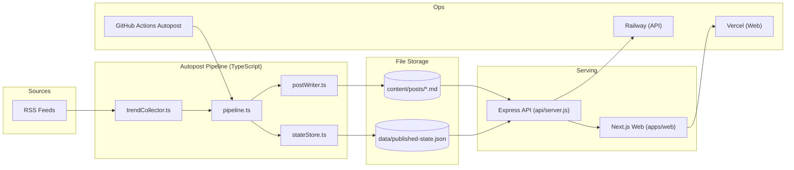
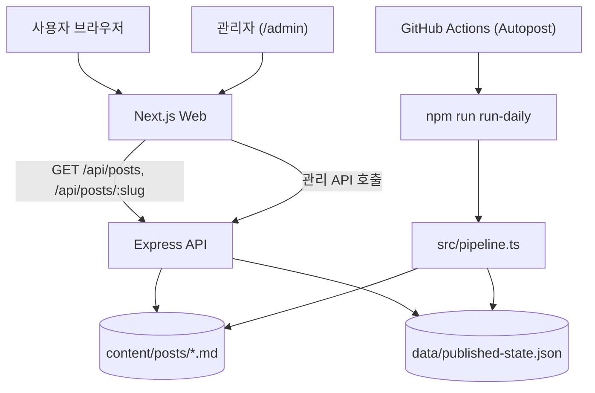
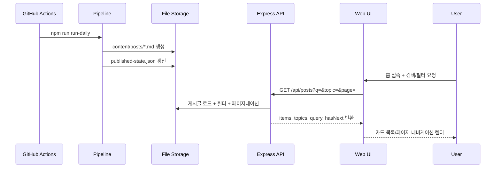
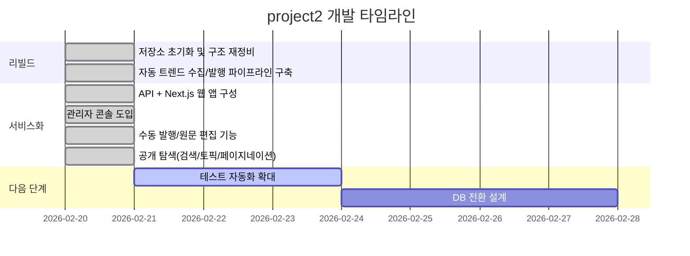

# project2 - 핫이슈 자동 발행 커뮤니티

> **"수집 → 생성 → 발행 → 탐색"**
>
> 트렌드 피드를 자동으로 수집하고, 글을 생성해 공개 페이지까지 연결하는 B 커뮤니티 자동화 시스템입니다.

<div align="center">

[](https://github.com/doublesilver/project2/actions/workflows/autopost.yml)
[](https://nodejs.org/)
[](https://www.typescriptlang.org/)
[](https://nextjs.org/)
[](https://expressjs.com/)

**운영 모드**: Local-first (배포 연동 준비 완료) | **저장소**: [github.com/doublesilver/project2](https://github.com/doublesilver/project2)

</div>

---

## 프로젝트 개요

| 항목 | 내용 |
|------|------|
| **프로젝트명** | project2 (B Community) |
| **목표** | A 서비스 유입을 위한 핫이슈 자동 발행 + 공개 탐색 페이지 운영 |
| **현재 구조** | `src`(자동발행 파이프라인) + `api`(Express API) + `apps/web`(Next.js) |
| **개발 기간** | 2026.02.20 리빌드 기준 지속 개선 중 |
| **개발 인원** | 1인 (기획 / 개발 / 배포 구성) |
| **서비스 URL** | 로컬 우선 운영 (`http://localhost:3000`, `http://localhost:3001`) |
| **README 운영 정책** | 작업 커밋 단위로 `README.md` 동기화 유지 |

---

## 주요 기능

| 기능 | 설명 |
|------|------|
| **자동 트렌드 수집** | RSS 피드(구글 뉴스/Reddit) 수집 및 URL 정규화/중복 제거 |
| **토픽 후보 산출** | 토큰화 + 불용어 필터 + 최신성 가중치로 트렌드 토픽 점수화 |
| **자동 글 생성** | 프론트매터 포함 마크다운 게시글 자동 생성 (`content/posts/*.md`) |
| **중복/과발행 방지** | `seenUrls`, `topic cooldown`, `daily cap` 기반 발행 제어 |
| **공개 탐색 UX** | 검색(`q`), 토픽 칩(`topic`), 페이지네이션(`page`) 지원 |
| **게시글 상세 페이지** | 본문 렌더링 + 서비스 A 유입 CTA 제공 |
| **관리자 콘솔** | 자동 발행 1회 실행, 수동 발행, 원문 로드/편집/삭제 |
| **관리자 인증 모드** | `ADMIN_TOKEN` 인증 또는 로컬 IP 한정 접근 |
| **자동 커밋 루프** | GitHub Actions(하루 3회)로 게시글 생성 후 `main` 커밋/푸시 |

---

## 기술 스택



### Frontend
| 기술 | 버전 | 용도 |
|------|------|------|
| Next.js | 14.2.18 | SSR/동적 라우팅 (`/`, `/posts/[slug]`, `/admin`) |
| React | 18.3.1 | UI 렌더링 |
| React DOM | 18.3.1 | 클라이언트 인터랙션 |

### Backend / API
| 기술 | 버전 | 용도 |
|------|------|------|
| Node.js | 22.x | 서버 런타임 |
| Express | 4.21.2 | REST API |
| cors | 2.8.5 | CORS 허용 도메인 제어 |
| gray-matter | 4.0.3 | 마크다운 + 프론트매터 파싱 |

### Autopost Pipeline
| 기술 | 버전 | 용도 |
|------|------|------|
| TypeScript | 5.7.3 | 파이프라인 구현 |
| tsx | 4.19.3 | TS 실행 (`run-once`, `run-daily`, `autopilot`) |
| rss-parser | 3.13.0 | RSS 수집 |
| node-cron | 4.2.1 | 로컬 스케줄러 |
| zod | 3.24.2 | 환경변수 검증 |

### Infrastructure
| 서비스 | 용도 |
|--------|------|
| GitHub Actions | 스케줄 자동발행 + 변경분 커밋/푸시 |
| Railway | API 배포 타깃 |
| Vercel | 프론트엔드 배포 타깃 |

---

## 시스템 아키텍처



### 자동 발행/탐색 흐름


### 핵심 데이터
| 파일 | 역할 |
|------|------|
| `content/posts/*.md` | 게시글 본문/메타(프론트매터) 저장소 |
| `data/published-state.json` | 중복 URL, 최근 토픽, 일일 발행 카운트, 게시 이력 상태 저장 |

---

## 프로젝트 구조

```text
project2/
├── src/                                # 자동 발행 파이프라인 (TypeScript)
│   ├── cli.ts                          # run-once / run-daily / autopilot 진입점
│   ├── config.ts                       # ENV 로드 + 검증
│   ├── trendCollector.ts               # RSS 수집/정규화/후보 추출
│   ├── pipeline.ts                     # 발행 판단 + 파일 저장
│   ├── postWriter.ts                   # 마크다운 본문 생성
│   ├── scheduler.ts                    # node-cron 스케줄러
│   └── stateStore.ts                   # 상태 파일 입출력
│
├── api/
│   └── server.js                       # 게시글 API + 관리자 API
│
├── apps/web/                           # Next.js 프론트엔드
│   ├── app/page.jsx                    # 홈(검색/토픽필터/페이지네이션)
│   ├── app/posts/[slug]/page.jsx       # 상세 페이지
│   ├── app/admin/page.jsx              # 운영 콘솔
│   ├── app/globals.css                 # 스타일
│   └── lib/api.js                      # API 클라이언트
│
├── content/posts/                      # 생성 게시글 마크다운
├── data/published-state.json           # 발행 상태 저장
├── .github/workflows/autopost.yml      # 하루 3회 자동 발행 워크플로
└── docs/deployment/vercel-railway.md   # 배포 가이드
```

---

## 로컬 실행 방법

### 요구 사항
- Node.js 22.x 이상
- npm 10.x 이상

### Quick Start
```bash
# 저장소 클론
git clone https://github.com/doublesilver/project2.git
cd project2

# 의존성 설치
npm install
npm --prefix apps/web install

# 환경변수 준비
cp .env.example .env
cp api/.env.example api/.env
cp apps/web/.env.example apps/web/.env.local

# 샘플 1건 생성 (일일 제한 무시)
npm run run-once

# API + WEB 동시 실행
npm run dev
```

### 개별 실행
```bash
# API (http://localhost:3001)
npm run api:dev

# WEB (http://localhost:3000)
npm run web:dev
```

### 주요 엔드포인트
- `GET /healthz`
- `GET /api/posts?limit=20&page=1&q=채용&topic=채용`
- `GET /api/posts/:slug`
- `GET /api/meta`
- `GET /api/admin/status`
- `POST /api/admin/generate-once`
- `POST /api/admin/posts/manual`
- `GET /api/admin/posts/:slug/raw`
- `PUT /api/admin/posts/:slug`
- `DELETE /api/admin/posts/:slug`

---

## 테스트

현재 리포지토리는 단위/통합 테스트 스위트보다, 타입/빌드/실행 검증 중심으로 운영 중입니다.

| 검증 항목 | 명령어 | 목적 |
|------|------|------|
| API 문법 검사 | `node --check api/server.js` | 서버 파일 파싱 오류 방지 |
| 타입 검사 | `npm run typecheck` | 파이프라인 타입 안전성 확인 |
| 프론트 빌드 | `npm run web:build` | Next.js 프로덕션 빌드 가능 여부 확인 |

```bash
node --check api/server.js
npm run typecheck
npm run web:build
```

---

## 성능

### 프론트 빌드 기준(Next.js)
`npm run web:build` 기준 번들 크기:

| 경로 | First Load JS |
|------|---------------|
| `/` | 94.2 kB |
| `/posts/[slug]` | 94.2 kB |
| `/admin` | 97.2 kB |
| Shared JS | 87.2 kB |

### 현재 운영 특성
- 데이터 저장이 파일 기반이라 초기 구조가 단순하고 복구가 용이함
- API 검색/필터/페이지네이션은 메모리 필터링 기반(소규모 콘텐츠에 적합)
- 대규모 트래픽 단계에서는 DB 전환 + 인덱싱 도입이 필요

---

## 보안

### 애플리케이션
| 영역 | 구현 |
|------|------|
| CORS | `CORS_ORIGIN` 기반 단일/다중 도메인 허용 목록 |
| Admin 인증 | `ADMIN_TOKEN` 사용 시 토큰 필수, 미설정 시 로컬 IP만 허용 |
| 요청 본문 제한 | `express.json({ limit: "2mb" })` |
| 입력 검증 | 수동 발행 시 제목/토픽/본문 길이 및 최대 크기 검증 |
| 커맨드 실행 | `execFile("npm", ["run", "run-once"])` 고정 인자 사용 |

### 운영 권장사항
| 항목 | 권장 |
|------|------|
| 프로덕션 API | `CORS_ORIGIN=*` 사용 금지, 배포 도메인만 명시 |
| 관리자 보호 | `ADMIN_TOKEN` 필수 설정 + 노출 금지 |
| 비밀값 관리 | `.env` 커밋 금지, 배포 환경변수로만 주입 |

---

## 기술적 도전과 해결

| 도전 | 해결 |
|------|------|
| RSS 피드 중복 링크 문제 | URL 정규화 + `seenUrls` 상태 저장으로 중복 게시 방지 |
| 토픽 연속 발행 편향 | `TOPIC_COOLDOWN_HOURS` 기반 쿨다운 로직 적용 |
| 하루 발행량 제어 | `POSTS_PER_DAY`, `POSTS_PER_RUN` + 날짜별 카운트 적용 |
| DB 없는 초기 운영 | 마크다운/JSON 파일 기반 저장소로 빠른 MVP 구축 |
| 운영 개입 필요성 | `/admin` 콘솔에서 수동 발행/수정/삭제/원문 편집 제공 |
| 공개 탐색 확장성 | `q + topic + page` API와 홈 UI 연동으로 탐색 고도화 |

---

## 개발 타임라인



---

## 문서

| 문서 | 설명 |
|------|------|
| [README.md](README.md) | 프로젝트 전체 개요/실행/운영 가이드 (작업 단위 갱신) |
| [배포 가이드](docs/deployment/vercel-railway.md) | Railway(API) + Vercel(Web) 배포 절차 |
| [웹 앱 안내](apps/web/README.md) | 프론트 로컬 실행 및 관리자 콘솔 요약 |
| [.env 예시](.env.example) | 자동발행 파이프라인 환경변수 |
| [API env 예시](api/.env.example) | API 서버 환경변수 |
| [웹 env 예시](apps/web/.env.example) | 프론트 환경변수 |
| [Autopost 워크플로](.github/workflows/autopost.yml) | 스케줄 자동발행/자동커밋 정의 |

---

## License

현재 저장소에는 별도 `LICENSE` 파일이 없습니다.  
배포/외부 공개 정책에 맞춰 라이선스를 확정해 추가하는 것을 권장합니다.

---

<div align="center">

*본 프로젝트는 자동 발행 파이프라인 실험 및 운영 자동화 검증 목적으로 개발되었습니다.*

**Maintained with commit-first workflow**

</div>
